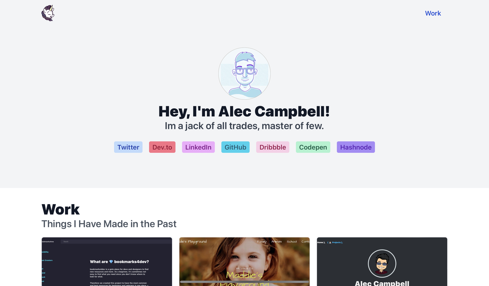

# uvacoder434

  

This source of my personal website. It's built with following technologies:
* [React](https://reactjs.org/) – My frontend library of choice.
* [Next.js](https://nextjs.org/) – It's static site generation is amazing, especially when hosted on [Vercel](https://vercel.com).
* [react-notion](https://github.com/splitbee/react-notion) – Renders most of the content on the page. Notion as a CMS is super convenient. 
* [TypeScript](https://typescriptlang.org) – Typed JavaScript. I love it.
* [Tailwind CSS](https://tailwindcss.com/docs/installation) – My favorite way of writting CSS nowadays.

## Local development

Provide a `GITHUB_TOKEN` inside your `.env` file.

